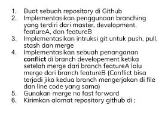

# Summary Version Control & Branch Management (Git)

## Resume
Pada materi ini, yang dipelajari adalah
1. Versioning
2. Git
3. Setting up pada Git

### Pengertian Git
Git adalah salah satu VCS (Version Control System) yang digunakan untuk memanajemen source code secara bersama dari sebuah app dengan mengatur collaborator, versioning program dan lain-lain melalui github salah satunya sebagai hosting service dari git.

### Git Staging Area
Git terbagi menjadi 3 area:
1) Working directory = area kerja direktori yang masih dalam bentuk local pada komputer user
2) Staging area = direktori sudah di tambahkan pada server git, namun belum di push/upload pada server
3) Repository = working area dari github yang sudah di push/upload pada server

### Setting Up pada Git
Setting up pada git:
- git init: inisialisasi git pada repository yang sudah dibuat
- git clone: mengkloning repository yang telah dibuat dengan folder local
- git stash: meng-unstaging perubahan pada repository
- git reset: membatalkan perubahan local ke state pada repository
- git push: mengupload file atau pembaruan ke repository
- git remote: melihat/menghapus/membuat koneksi ke repository lain
- git branch: memanajemen branching pada repository
- git merge: menggabungkan file dari satu branch ke branch lain

## Task

hasil: