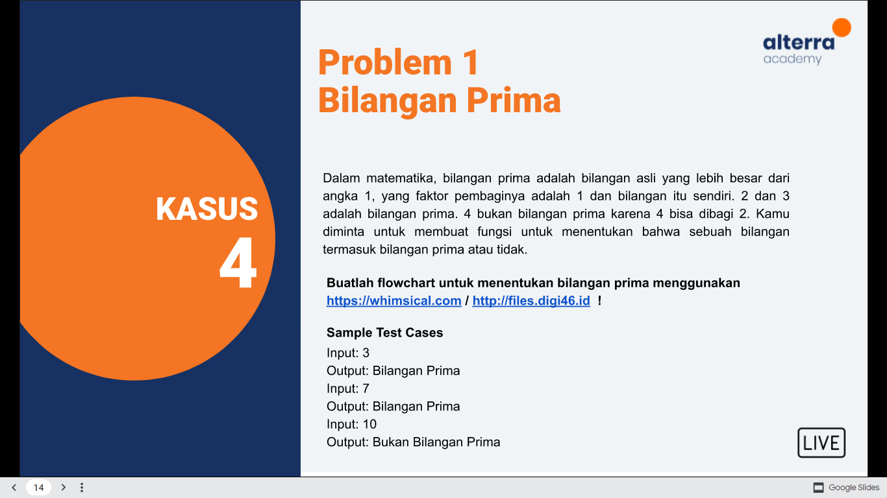
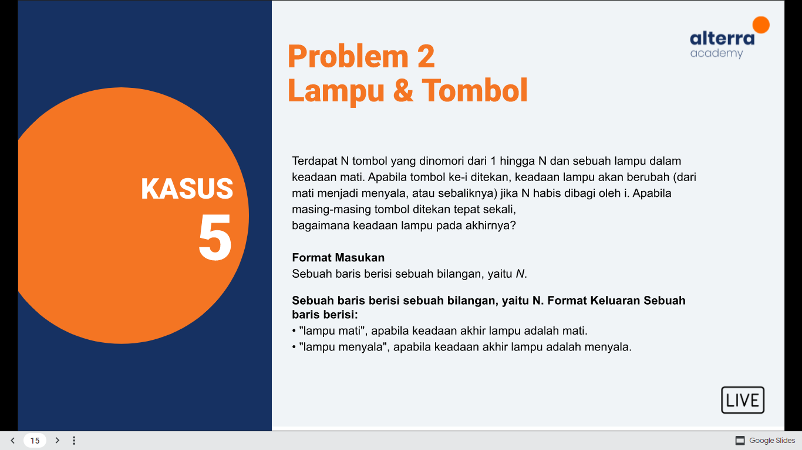
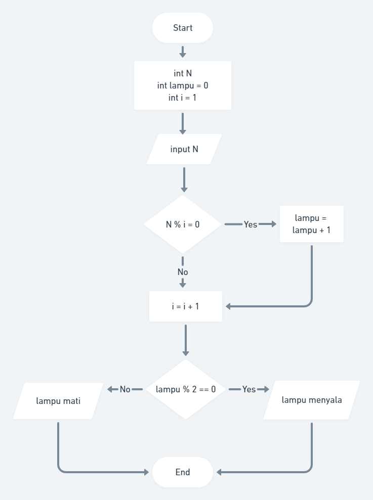
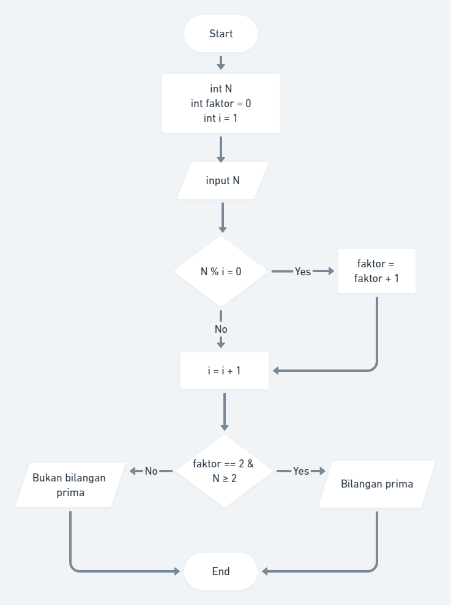

# Summary Introduction Algorithm

## Resume
Pada materi kali ini yang dipelajari adalah:
1. Apa itu Algoritma
2. Karakteristik
3. Pseudocode & Flowchart

### Apa itu Algoritma
Prosedur komputasi yang didefinisikan secara sekuensial dengan baik untuk memproses nilai input dan menghasilkan output.

### Karakteristik Algoritma
1. Memiliki batas (awal dan akhir)
2. Intruksi terdefinisi dengan baik
3. Efektif dan efisien

### Pseudocode & Flowchart
- Pseudocode : penulisan kode program secara sederhana menggunakan pola bahasa inggris.
- Flowchart : bagan dengan simbol tertentu yang menggambarkan urutan dan hubungan antra proses secara mendetail. 

## Task

## Hasil

