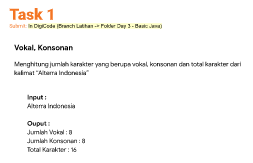
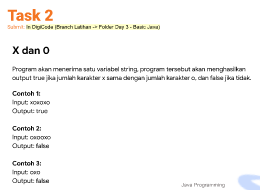
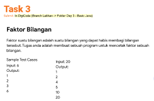
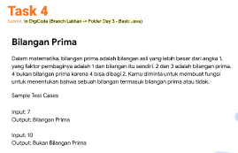
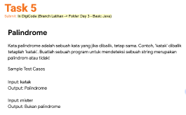
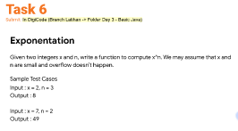
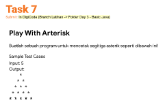
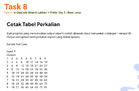

# Summary Basic Programming

## Resume
1. Basic Programming (Java)
2. Tipe Data
3. Branching
4. Looping
5. Input Output
6. Operator 
7. Method

### Basic Programming Java
Java merupakan salah satu bahasa pemrograman yang banyak dipakai oleh programmer. Java digunakan sebagai server-side language dengan sebagian besar untuk proses back-end development termasuk pengembangan aplikasi Android, desktop, games dan lain-lain.

### Macam-macam Tipe Data
- Tipe data primitif: short, long, byte, int, boolean, float, char, double.
- Tipe data non primitif: String, Integer, Interface, Enum dll.

### Branching/Percabangan
- If else
- Switch

### Looping/Perulangan
- for loop
- while loop
- do while loop
- foreach
- break & continue

### IO
- Scanner
- Buffered Reader

### Operator
Opeartor merupakan simbol atau perintah yang digunakan untuk melakukan operasi aritmatika

### Method/Function
Sebuah fungsi atau perintah yg dikelompokkan untuk menjalankan tugas tertentu baik menggunakan pengembalian nilai (return value) ataupun tidak (void).

### Task

### Hasil
- Task 1 
- Task 2 
- Task 3 
- Task 4 
- Task 5 
- Task 6 
- Task 7 
- Task 8 